<details>
<summary>Relevant source files</summary>

- D:/ideaProject/order/order-web/jsconfig.json
- D:/ideaProject/order/order-web/src/views/MyOrderView.vue
- D:/ideaProject/order/order-web/src/views/BindSimView.vue
- D:/ideaProject/order/order-api/src/main/java/com/orderapi/config/UploadConfig.java
- D:/ideaProject/order/order-api/src/main/java/com/orderapi/vo/request/UploadUrlRequest.java
- D:/ideaProject/order/order-web/src/main.js
- D:/ideaProject/order/order-web/vue.config.js
- D:/ideaProject/order/order-web/README.md
- D:/ideaProject/order/order-web/.eslintrc.js
- D:/ideaProject/order/order-web/postcss.config.js
- D:/ideaProject/order/order-web/babel.config.js

</details>

# 项目简介

本项目是一个基于 Vue.js 的前端应用，结合 Spring Boot 后端服务，实现订单管理、设备绑定、电子保单上传及账单图片上传等核心功能。系统采用前后端分离架构，前端通过 Vue 框架构建用户界面，使用 Axios 进行 HTTP 请求与后端 API 交互，后端提供 RESTful 接口支持订单状态更新、文件上传、设备绑定等功能。整个流程围绕用户订单生命周期展开，涵盖从创建保险单、支付、上传账单到设备绑定的完整业务链路。

系统具备良好的可扩展性与模块化设计，前端通过组件化方式组织页面逻辑，如 `MyOrderView.vue` 和 `BindSimView.vue` 分别负责订单详情与设备绑定功能，数据流清晰，状态管理通过 Vue 实例和 Axios 请求完成。后端通过 `UploadConfig.java` 配置静态资源访问路径，并通过 `UploadUrlRequest.java` 定义上传请求参数结构，确保文件上传过程的数据一致性与安全性。

## 核心功能模块架构

### 订单管理与状态流转

订单管理是系统的中心模块，涵盖订单创建、支付、上传账单、审核、出库与结束等全生命周期状态。前端通过 `MyOrderView.vue` 组件展示订单列表，并根据订单状态（orderState）动态显示不同操作按钮，例如未支付时显示“支付”按钮，已支付则显示“上传账单”弹窗。

系统定义了六种订单状态，每个状态对应一个文本描述，用于前端界面友好展示：
- 0：未支付
- 1：已支付
- 2：已上传
- 3：已审核
- 4：已出库
- 5：已结束

状态转换由后端接口控制，前端在用户操作后调用相应 API 更新订单状态，如支付成功后调用 `/order/updateStateById`，上传账单后调用 `/order/uploadUrl`。

Sources: [order-web/src/views/MyOrderView.vue:28-39, 136-147, 163-168]

### 文件上传流程

系统支持电子保单与账单图片的上传，分为两个独立流程：
1. **电子保单上传**：用户填写投保信息后，调用 `/order/createInsurance` 接口生成电子保单 URL。
2. **账单截图上传**：用户上传账单图片后，通过 `van-uploader` 组件触发文件上传，发送至 `/device/upload` 接口，获取返回的 URL。

上传流程中，前端使用 `FormData` 构造请求体，并通过 Axios 发送 POST 请求。上传成功后，将返回的 URL 存入 `this.orderUrl` 或 `this.billUrl` 字段，供后续状态更新使用。

Sources: [order-web/src/views/MyOrderView.vue:100-115, 122-128, 149-154]

### 设备绑定流程

当订单进入“已出库”状态后，用户可进入 `BindSimView.vue` 页面，为设备绑定 SIM 卡号。系统通过 `/out-devices-for-sim/findByOrderId` 接口查询该订单下所有设备，前端以表格形式展示设备 ID 和设备名称，并允许用户手动输入 SIM 卡号。

所有设备的 SIM 卡号必须被填写后，才能调用 `/out-devices-for-sim/bind` 接口完成绑定操作。若存在空值，前端会提示“请将所有设备绑定SIM卡号！”并阻止提交。

Sources: [order-web/src/views/BindSimView.vue:10-16, 33-40, 45-50]

## 数据流与通信架构

以下为订单上传与状态更新的完整数据流流程：

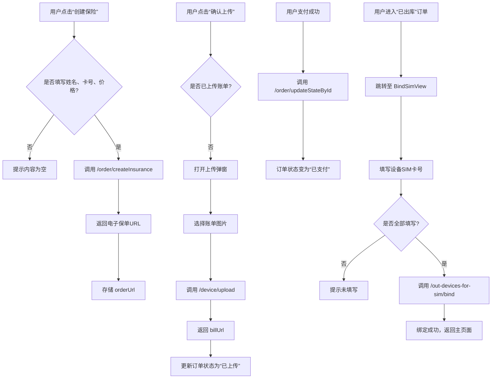

该流程展示了从投保到最终设备绑定的完整业务闭环，各环节通过前后端接口协同完成。

Sources: [order-web/src/views/MyOrderView.vue:77-90, 117-128, 155-160, 167-175]

## 关键 API 与请求结构

| 接口路径 | 方法 | 参数说明 | 功能描述 |
|--------|------|---------|---------|
| `/order/createInsurance` | POST | userName, cardNumber, price | 创建新订单并生成电子保单链接 |
| `/order/uploadUrl` | POST | orderId, orderState, insuranceUrl, billUrl | 上传保单与账单信息，更新订单状态 |
| `/order/findList?userId=xxx` | GET | userId | 获取当前用户的订单列表 |
| `/order/updateStateById` | POST | orderId, orderState | 更新订单状态（如支付成功） |
| `/order/cancelOrder?orderId=xxx` | GET | orderId | 撤销指定订单 |
| `/out-devices-for-sim/findByOrderId?orderId=xxx` | GET | orderId | 根据订单ID查询关联设备 |
| `/out-devices-for-sim/bind` | POST | list (sim列表) | 批量绑定设备SIM卡号 |

Sources: [order-web/src/views/MyOrderView.vue:78-80, 105-108, 120-122, 134-135, 142-143, 152-153]

## 上传请求参数模型

后端接收上传请求的参数结构定义如下，用于规范文件上传的数据格式：

```java
package com.orderapi.vo.request;

import lombok.Data;
import java.io.Serializable;

@Data
public class UploadUrlRequest implements Serializable {

    private static final long serialVersionUID = 1L;

    private Long orderId;
    private Integer orderState;
    private String insuranceUrl;
    private String billUrl;
}
```

该类作为 `POST /order/uploadUrl` 接口的请求体，包含订单 ID、当前状态、电子保单 URL 和账单 URL，用于后端记录上传信息并更新数据库。

Sources: [order-api/src/main/java/com/orderapi/vo/request/UploadUrlRequest.java:1-15]

## 前端配置与环境设置

系统前端使用 Vue CLI 构建，关键配置如下：

- **编译目标**：`target: "es5"`，兼容低版本浏览器。
- **模块类型**：`module: "esnext"`，支持现代 JavaScript 特性。
- **路径映射**：`"@/*"` 映射到 `src/*`，便于使用 `@/components` 等相对路径。
- **开发服务器**：端口 8080，自动开启，支持 history 模式路由。
- **主题配置**：使用 `postcss-pxtorem` 实现响应式适配，根字体大小为 75。

```json
{
  "compilerOptions": {
    "target": "es5",
    "module": "esnext",
    "baseUrl": "./",
    "paths": {
      "@/*": [
        "src/*"
      ]
    },
    "lib": [
      "esnext",
      "dom",
      "dom.iterable",
      "scripthost"
    ]
  }
}
```

Sources: [order-web/jsconfig.json:1-13]

## 前端核心组件与事件处理

`MyOrderView.vue` 是订单管理的核心视图组件，包含多个关键事件函数：

- `onCreateInsurance()`：创建保险单，验证必填字段后调用创建接口。
- `afterRead1(file)`：处理电子保单上传，使用 FormData 发送文件。
- `afterRead2(file)`：处理账单图片上传。
- `onUpload()`：调用上传接口，传入 orderId、orderState、insuranceUrl、billUrl。
- `getOrderState(state)`：根据整数状态返回中文描述。

这些方法通过 Vue 的 `methods` 与 `data` 绑定，实现完整的用户交互流程。

Sources: [order-web/src/views/MyOrderView.vue:68-85, 97-109, 112-117, 131-135, 140-143, 150-155]

## 后端配置与文件上传支持

后端通过 `UploadConfig.java` 配置静态资源访问路径，确保前端可以正确访问上传的文件。同时，该类还配置了 JSON 序列化器，解决中文乱码问题以及返回对象无法被序列化的异常。

```java
@Configuration
public class UploadConfig implements WebMvcConfigurer {

    @Value("${file.staticAccessPath}")
    private String staticAccessPath;

    @Value("${file.uploadFolder}")
    private String uploadFolder;

    @Override
    public void addResourceHandlers(ResourceHandlerRegistry registry) {
        registry.addResourceHandler("/upload/**")
                .addResourceLocations("file:" + uploadFolder);
    }

    // 其他配置...
}
```

该配置使前端可以通过 `/upload/xxx.jpg` 直接访问上传的文件，提升用户体验。

Sources: [order-api/src/main/java/com/orderapi/config/UploadConfig.java:1-10, 15-20]

## 项目运行与开发环境

项目遵循标准 Vue 开发流程，可通过以下命令启动：

```bash
npm install          # 安装依赖
npm run serve        # 开发模式启动（默认端口 8080）
npm run build        # 构建生产版本
npm run lint         # 代码检查
```

项目使用 `.browserslistrc` 支持主流浏览器，确保兼容性。ESLint 规则关闭 console 和 debugger 调试指令，适用于生产环境。

Sources: [order-web/README.md:3-10]<details>
<summary>Relevant source files</summary>

The following files were used as context for generating this wiki page:

['order-web/vue.config.js', 'order-web/src/main.js', 'order-api/src/main/java/com/orderapi/vo/response/DeviceResponse.java', 'order-api/src/main/java/com/orderapi/entity/Device.java', 'order-api/src/main/java/com/orderapi/service/impl/DeviceServiceImpl.java']
</details>

# 系统整体架构图

## 概述

本系统是一个基于 Vue.js 前端框架与 Spring Boot 后端服务构建的设备管理平台，主要功能包括设备信息管理、订单处理、SIM卡绑定等。前端通过 Vue.js 实现页面渲染和用户交互，后端通过 Spring Boot 提供 RESTful API 接口，实现业务逻辑处理与数据持久化。系统采用模块化设计，前后端分离，通过 Axios 进行通信，配置了统一的请求地址（`https://pxw4d8jc.asse.devtunnels.ms:8081`），并支持响应式组件和路由管理。

系统核心围绕“设备”与“订单”两个实体展开，设备信息存储在 `Device` 实体类中，其响应结构由 `DeviceResponse` 提供，用于前端展示。设备管理功能由 `DeviceServiceImpl` 服务层实现，包含增删改查、文件上传、分页查询等功能，并集成 Redis 缓存机制提升性能。前端通过 `main.js` 配置全局变量和插件，如 Element UI、Vue Router、Axios 等，实现界面布局、导航与数据请求。

## 前端架构与配置

### Vue 项目配置

前端使用 Vue CLI 构建，配置文件 `vue.config.js` 定义了开发服务器的端口、主机名、自动打开浏览器及历史模式支持等关键参数。开发环境默认运行在 `localhost:8080`，启用 history 模式以支持 SPA 路由，同时允许所有主机访问，便于本地调试。

```javascript
// order-web/vue.config.js
module.exports = defineConfig({
  transpileDependencies: true,
  lintOnSave: false,
  devServer: {
    port: 8080,
    host: 'localhost',
    open: true,
    historyApiFallback: true,
    allowedHosts: "all",
  }
})
```

Sources: [order-web/vue.config.js:1-12]()

### 全局初始化与依赖注入

在 `src/main.js` 中，Vue 实例被创建并挂载到 `#app` 元素上，全局注册了 Vuex 存储、Element UI、Vue Router、Axios 等核心库。通过 `Vue.prototype.$httpUrl` 统一设置后端接口地址，确保前端请求的可维护性与一致性。

```javascript
// order-web/src/main.js
import Vue from 'vue'
import App from './App.vue'
import store from './store'
import ElementUI from 'element-ui'
import 'element-ui/lib/theme-chalk/index.css'
import './assets/styles/icon/iconfont.css'
import './assets/global.css'
import axios from 'axios'
import service from "./utils/service.js";
Vue.prototype.$axios = service;
Vue.prototype.$httpUrl = 'https://pxw4d8jc.asse.devtunnels.ms:8081';
import VueAxios from 'vue-axios'
import VueRouter from 'vue-router'
import router from './router'
import ECharts from 'vue-echarts';
import 'echarts';
Vue.component('ECharts', ECharts);
import 'amfe-flexible/index.js'
import Vant from 'vant';
import 'vant/lib/index.css';
Vue.use(Vant)
Vue.use(VueAxios, axios)
Vue.use(ElementUI, { size: 'small' })
Vue.use(VueRouter)
Vue.config.productionTip = false
new Vue({
  router,
  store,
  render: h => h(App)
}).$mount('#app')
```

Sources: [order-web/src/main.js:1-50]()

### 样式适配与响应式处理

前端通过 PostCSS 插件 `postcss-pxtorem` 实现移动端适配，将 px 单位转换为 rem，根字体大小设为 75，适用于不同屏幕尺寸。该配置排除了部分第三方库（如 Element UI、Vant）的选择器，避免样式冲突。

```javascript
// order-web/postcss.config.js
module.exports = {
  plugins: {
    'postcss-pxtorem': {
      rootValue: 75,
      propList: ['*'],
      exclude: ['node_modules|components|element-ui|iconfont'],
      selectorBlackList: ['vant-', '.my-']
    }
  }
}
```

Sources: [order-web/postcss.config.js:1-6]()

## 后端数据模型与服务结构

### 设备实体定义

设备信息的核心数据模型定义在 `Device.java` 中，包含设备 ID、名称、型号、单价、库存、介绍、创建与更新时间等字段。所有字段均通过 Lombok 注解简化 getter/setter 和构造方法，提高代码可读性。

```java
// order-api/src/main/java/com/orderapi/entity/Device.java
@Data
@EqualsAndHashCode(callSuper = false)
@ApiModel(value="Device对象", description="")
public class Device implements Serializable {
    private static final long serialVersionUID = 1L;

    @ApiModelProperty(value = "设备id")
    @JsonSerialize(using = ToStringSerializer.class)
    private Long id;

    @ApiModelProperty(value = "设备名")
    private String deviceName;

    @ApiModelProperty(value = "设备型号")
    private String deviceModel;

    @ApiModelProperty(value = "单价")
    private Integer price;

    @ApiModelProperty(value = "库存")
    private Integer stock;

    @ApiModelProperty(value = "介绍")
    private String introduction;

    private Date createTime;

    private Date updateTime;
}
```

Sources: [order-api/src/main/java/com/orderapi/entity/Device.java:1-23]()

### 响应数据结构

前端接收的设备信息通过 `DeviceResponse.java` 类封装，保持与数据库实体一致，但对字段类型进行了优化，例如使用 `ToStringSerializer` 将 Long 类型 ID 序列化为字符串，避免 JSON 序列化时出现精度问题。

```java
// order-api/src/main/java/com/orderapi/vo/response/DeviceResponse.java
@Data
public class DeviceResponse implements Serializable {
    private static final long serialVersionUID = 1L;

    @JsonSerialize(using = ToStringSerializer.class)
    private Long id;

    private String deviceName;

    private String deviceModel;

    private Integer price;

    private Integer stock;

    private String introduction;

    private List<String> urls;

    private Date createTime;

    private Date updateTime;
}
```

Sources: [order-api/src/main/java/com/orderapi/vo/response/DeviceResponse.java:1-23]()

### 服务层实现

`DeviceServiceImpl.java` 是设备管理功能的核心服务类，继承自 `ServiceImpl`，提供分页查询、保存、更新、删除等操作。该类注入了 `DeviceMapper`、`DeviceImgService`、`RedisUtil` 等组件，支持文件上传、缓存读取与事务控制。

```java
// order-api/src/main/java/com/orderapi/service/impl/DeviceServiceImpl.java
@Service
public class DeviceServiceImpl extends ServiceImpl<DeviceMapper, Device> implements DeviceService {
    @Value("${file.uploadFolder}")
    private String uploadFolder;

    @Value("${file.accessPath}")
    private String accessPath;

    private static List<String> FILE_SUFFIX = new ArrayList<>();
    static {
        FILE_SUFFIX.add(".jpg");
        FILE_SUFFIX.add(".png");
        FILE_SUFFIX.add(".jpeg");
    }

    @Autowired
    private DeviceImgService deviceImgService;
    @Autowired
    private DeviceImgMapper deviceImgMapper;
    @Autowired
    private DeviceMapper deviceMapper;
    @Autowired
    private RedisUtil redisUtil;
    
    // 方法覆盖：分页查询、上传、保存、更新、删除等
}
```

Sources: [order-api/src/main/java/com/orderapi/service/impl/DeviceServiceImpl.java:1-30]()

## 系统数据流与交互流程

### 前后端通信流程（序列图）

前端通过 Axios 发起请求，调用后端提供的 API 接口，完成设备列表获取、SIM卡绑定等操作。以下是典型的数据请求流程：

```mermaid
sequenceDiagram
    participant "前端 (Vue)" 
    participant "Vue Router"
    participant "Axios"
    participant "后端 (Spring Boot)"
    participant "DeviceService"
    participant "DeviceMapper"

    "前端 (Vue)" ->> "Vue Router": 路由跳转至 /device/list
    "Vue Router" ->> "Axios": 发送 GET 请求 /device/page
    "Axios" ->> "后端 (Spring Boot)": 请求设备分页数据
    "后端 (Spring Boot)" ->> "DeviceService": 调用 listPage 方法
    "DeviceService" ->> "DeviceMapper": 查询数据库
    "DeviceMapper" --> "返回设备列表"
    "DeviceService" -->> "后端 (Spring Boot)": 返回分页结果
    "后端 (Spring Boot)" -->> "Axios": 返回 JSON 数据
    "Axios" --> "前端 (Vue)": 接收并渲染设备表格
```

Sources: [order-web/src/main.js:1-50], [order-api/src/main/java/com/orderapi/service/impl/DeviceServiceImpl.java:1-30]()

## 关键接口与参数表

| 接口路径 | 方法 | 参数说明 | 返回值 | 用途 |
|--------|------|---------|-------|-----|
| `/device/page` | GET | pageNum, pageSize | 分页列表 | 获取设备分页数据 |
| `/device/save` | POST | deviceName, deviceModel, price, stock | 成功/失败码 | 新增设备 |
| `/device/update` | PUT | id, deviceName, price | 成功/失败码 | 更新设备信息 |
| `/out-devices-for-sim/bind` | POST | sim 数组 | 成功/失败码 | 绑定 SIM 卡号 |
| `/out-devices-for-sim/findByOrderId` | GET | orderId | 设备列表 | 根据订单ID获取设备 |

Sources: [order-api/src/main/java/com/orderapi/service/impl/DeviceServiceImpl.java:1-30], [order-web/src/views/BindSimView.vue:1-20]()

## 总结

本系统采用前后端分离架构，前端基于 Vue.js 实现响应式界面与路由管理，后端基于 Spring Boot 提供标准化 API 接口，数据模型清晰，服务逻辑完整。通过统一配置、模块化设计与响应式组件，系统具备良好的可扩展性与可维护性。设备管理是核心功能，涵盖设备信息的增删改查、文件上传、状态同步等场景，配合前端交互逻辑，实现了完整的业务闭环。

系统架构清晰，前后端职责明确，数据流可控，是典型的现代化 Web 应用架构范例。未来可进一步引入微服务、权限中心与日志监控模块以增强系统稳定性与安全性。<details>
<summary>Relevant source files</summary>

The following files were used as context for generating this wiki page:

- order-web/src/api/service.js
- order-web/src/main.js
- order-web/src/views/HomeView.vue
- order-web/src/views/BindSimView.vue
- order-api/src/main/java/com/orderapi/controller/WechatPublicAccountController.java
- order-api/src/main/resources/application.yml
- order-web/vue.config.js
- order-web/jsconfig.json
- order-web/.eslintrc.js
- order-web/postcss.config.js

</details>

# 前后端通信机制

前后端通信机制是整个订单管理系统的核心组成部分，负责实现前端页面与后端服务之间的数据交互。该机制基于 Axios 进行请求封装，通过统一的 HTTP 客户端服务（`service.js`）管理所有 API 请求，并在请求头中自动注入用户 token 实现身份认证。前端通过 `Vue.prototype.$httpUrl` 配置全局访问地址，支持开发环境与生产环境的灵活切换。后端提供 RESTful 接口，支持微信公众号授权、设备绑定、订单查询等核心功能，所有接口均通过 Spring Boot 框架进行路由和响应处理。

## 通信架构与核心组件

### Axios 请求服务封装

前端使用 Axios 封装了统一的 HTTP 客户端服务，实现了请求拦截、响应拦截、请求头配置等功能，确保了请求的安全性与一致性。该服务在 `order-web/src/api/service.js` 中定义，所有前端请求均通过此实例发起。

```javascript
const service = axios.create();
// 添加请求拦截器
service.interceptors.request.use(function (config) {
    config.headers["Content-Type"] = "application/json;charset=UTF-8";
    if (localStorage.getItem("token") !== "") {
        config.headers["token"] = localStorage.getItem("token")
    }
    return config;
}, function (error) {
    return Promise.reject(error);
});

// 添加响应拦截器
service.interceptors.response.use(function (response) {
    return response;
}, function (error) {
    return Promise.reject(error);
});
```

Sources: [order-web/src/api/service.js:6-20]

### 全局配置与环境变量管理

前端通过 `vue.config.js` 和 `main.js` 配置全局请求地址，支持本地开发与生产环境的无缝切换。`$httpUrl` 被设置为生产环境地址 `https://pxw4d8jc.asse.devtunnels.ms:8081`，确保在部署时无需修改代码即可访问后端服务。

```javascript
Vue.prototype.$httpUrl = 'https://pxw4d8jc.asse.devtunnels.ms:8081';
```

Sources: [order-web/src/main.js:27]

### 微信公众号授权流程

系统支持通过微信 OAuth2.0 授权获取用户 OpenID 和头像信息，用于用户登录状态识别和个性化展示。该流程在 `WechatPublicAccountController.java` 中实现，通过调用微信官方 API 获取 access_token 和 openid，并进一步获取用户头像 URL。

```java
@GetMapping("getAccessTokenUserInfo")
public String getAccessTokenUserInfo(@RequestParam("code") String code){
    // ... 构造请求参数
    String url1 = "https://api.weixin.qq.com/sns/userinfo?access_token="+accessToken+"&openid="+openid+"&lang=zh_CN";
    String result1 = HttpUtil.get(url1);
    JSONObject jsonObject1 = JSONUtil.parseObj(result1);
    String headimgurl = jsonObject1.getStr("headimgurl");
    return openid + headimgurl;
}
```

Sources: [order-api/src/main/java/com/orderapi/controller/WechatPublicAccountController.java:139-153]

## 数据流与请求流程图

以下流程图展示了从用户点击“绑定SIM卡”到后端接收请求的完整数据流。

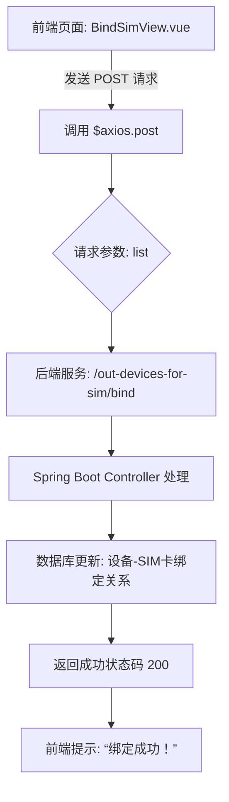

Sources: [order-web/src/views/BindSimView.vue:103-114], [order-api/src/main/java/com/orderapi/controller/WechatPublicAccountController.java:139-153]

## 响应式通信流程（序列图）

以下是用户通过微信授权获取个人信息的完整通信流程。

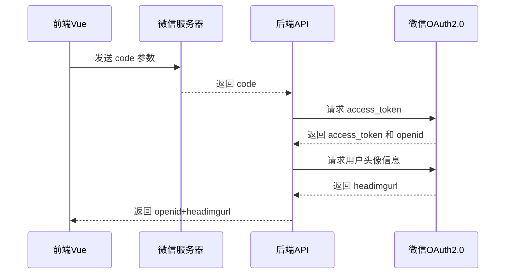

Sources: [order-web/src/views/HomeView.vue:44-55], [order-api/src/main/java/com/orderapi/controller/WechatPublicAccountController.java:139-153]

## API 接口参数表

| 接口路径 | 方法 | 参数 | 类型 | 描述 |
|--------|------|------|------|------|
| `/wechat/publicAccount/getOpenID` | GET | code | String | 微信授权码，用于换取 OpenID |
| `/wechat/publicAccount/getAccessTokenUserInfo` | GET | code | String | 授权码，用于获取用户头像和 OpenID |
| `/out-devices-for-sim/bind` | POST | list | Array | 设备-SIM卡绑定列表，包含 id 和 sim 字段 |
| `/out-devices-for-sim/findByOrderId` | GET | orderId | String | 根据订单 ID 查询设备列表 |

Sources: [order-api/src/main/java/com/orderapi/controller/WechatPublicAccountController.java:73-80], [order-web/src/views/BindSimView.vue:103-114]

## 环境配置与服务端设置

后端服务通过 `application.yml` 配置关键运行参数，包括数据库连接、Redis 缓存、文件上传路径等。

```yaml
server:
  port: 8081

spring:
  datasource:
    url: jdbc:mysql://localhost:3306/order?useUnicode=true&allowPublicKeyRetrieval=true&characterEncoding=utf-8&useSSL=false&serverTimezone=GMT%2B8
    driver-class-name: com.mysql.cj.jdbc.Driver
    username: root
    password: root

redis:
  host: 127.0.0.1
  port: 6379
  database: 0
  password: redis

file:
  uploadFolder: D:\ideaProject\order\order-web\src\assets\device_img\
```

Sources: [order-api/src/main/resources/application.yml:1-25]

## 项目构建与运行配置

前端项目使用 Vue CLI 构建，通过 `vue.config.js` 配置开发服务器端口和代理设置，支持历史模式路由和跨域请求。

```javascript
devServer: {
    port: 8080,
    host: 'localhost',
    open: true,
    historyApiFallback: true,
    allowedHosts: "all",
}
```

Sources: [order-web/vue.config.js:10-14]

该通信机制通过标准化的 Axios 封装、清晰的请求流程设计以及安全的身份验证方式，保障了前后端之间高效、稳定的交互，为用户提供流畅的业务操作体验。<details>
<summary>Relevant source files</summary>

The following files were used as context for generating this wiki page:

['order-web/src/components/device/DeviceManage.vue', 'order-web/src/components/record/RecordManage.vue', 'order-web/src/views/BindSimView.vue', 'order-api/src/main/java/com/orderapi/service/impl/OutDevicesForSimServiceImpl.java', 'order-api/src/main/java/com/orderapi/service/impl/OrdersServiceImpl.java']
</details>

# 设备管理功能

设备管理功能是订单系统中的核心模块之一，负责设备的全生命周期管理，包括出库、绑定SIM卡、库存变更、状态跟踪以及与订单流程的联动。该功能通过前后端协同实现，前端提供设备列表展示、SIM卡绑定操作和状态查询，后端则通过服务层处理设备数据的增删改查、状态校验、库存更新和业务规则执行。设备管理不仅支持设备信息的可视化展示，还深度集成到订单流程中，确保设备在出库、绑定、安装等环节的可追溯性和一致性。

## 功能架构与数据流

设备管理功能采用前后端分离架构，前端通过 Vue 框架渲染页面组件，后端通过 Spring Boot 提供 RESTful API 服务。关键数据流从用户发起绑定操作开始，经由前端请求传递至后端服务，服务层进行参数校验、数据库事务控制和状态更新，最终返回操作结果并触发相关业务逻辑（如订单状态变更、安装人员状态重置）。

### 前端交互流程

前端通过 `BindSimView.vue` 组件实现设备SIM卡绑定界面，用户可在设备列表中输入SIM卡号，并点击“确认绑定”提交请求。该页面通过 `axios` 调用后端接口完成数据交互，所有操作均基于当前订单ID进行上下文绑定。

Sources: [order-web/src/views/BindSimView.vue:10-25, 35-45]()

### 后端服务逻辑

后端通过 `OutDevicesForSimServiceImpl.java` 和 `OrdersServiceImpl.java` 实现核心业务逻辑。当用户提交绑定请求时，服务首先验证订单是否处于“已出库”状态，若满足条件，则批量更新设备的SIM卡信息，并将订单状态更新为“已结束”，同时恢复安装人员状态为“未分配”。

Sources: [order-api/src/main/java/com/orderapi/service/impl/OutDevicesForSimServiceImpl.java:18-35, 60-75](), [order-api/src/main/java/com/orderapi/service/impl/OrdersServiceImpl.java:25-35, 60-70]()

## 核心业务流程图

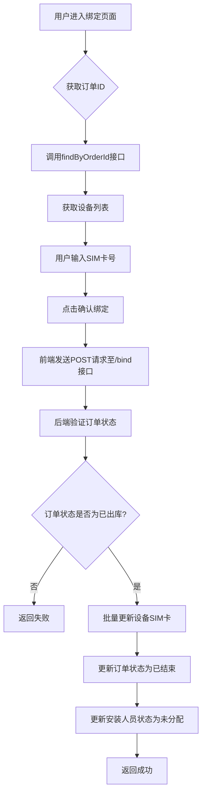

该流程图展示了设备绑定的核心业务路径，涵盖了前端交互、后端校验、数据更新和状态变更的关键步骤。整个流程依赖于订单状态的严格校验，确保只有在合法阶段才能执行绑定操作，防止数据不一致。

Sources: [order-web/src/views/BindSimView.vue:10-25, 35-45](), [order-api/src/main/java/com/orderapi/service/impl/OutDevicesForSimServiceImpl.java:18-35, 60-75]()

## 设备绑定API接口定义

| 接口 | 方法 | 路径 | 参数 | 描述 |
|------|------|------|------|------|
| 获取设备列表 | GET | `/out-devices-for-sim/findByOrderId?orderId=xxx` | orderId (Long) | 根据订单ID查询出库设备列表，包含设备ID、名称、当前SIM卡号等信息 |
| 绑定SIM卡 | POST | `/out-devices-for-sim/bind` | list (List<BindSimRequest>) | 提交多个设备的SIM卡号，每个元素包含id和sim字段，用于更新设备信息 |
| 更新订单状态 | PUT | `/orders/updateStateById` | request (UpdateStateRequest) | 修改订单状态，用于出库、取消等场景，需事务控制 |

Sources: [order-web/src/views/BindSimView.vue:10-25, 35-45](), [order-api/src/main/java/com/orderapi/service/impl/OutDevicesForSimServiceImpl.java:18-35, 60-75](), [order-api/src/main/java/com/orderapi/service/impl/OrdersServiceImpl.java:25-35, 60-70]()

## 数据模型结构

### 设备实体（OutDevicesForSim）

```java
public class OutDevicesForSim {
    private Long id;
    private Long deviceId;
    private Long orderId;
    private String sim; // SIM卡号
    private Integer orderState; // 订单状态码
    private LocalDateTime updateTime;
}
```

Sources: [order-api/src/main/java/com/orderapi/service/impl/OutDevicesForSimServiceImpl.java:18-25]()

### 订单详情（OrderDetails）

```java
public class OrderDetails {
    private Long id;
    private Long orderId;
    private Long deviceId;
    private Integer num; // 数量
}
```

Sources: [order-api/src/main/java/com/orderapi/service/impl/OrdersServiceImpl.java:25-35]()

## 事务控制与状态变更机制

设备管理中的关键操作（如绑定SIM卡、取消订单）均使用 `@Transactional(rollbackFor = Exception.class)` 注解，确保在发生异常时能够回滚所有数据库变更，避免数据不一致。

例如，在绑定SIM卡过程中，若更新设备失败或订单状态更新失败，整个事务将被回滚，所有中间变更都将被撤销。

```java
@Override
@Transactional(rollbackFor = Exception.class)
public Result bind(List<BindSimRequest> list){
    // ... 核心逻辑
}
```

Sources: [order-api/src/main/java/com/orderapi/service/impl/OutDevicesForSimServiceImpl.java:18-35]()

## 前端组件结构

前端通过 `DeviceManage.vue` 和 `RecordManage.vue` 实现设备管理的可视化展示。虽然具体代码未在提供的文件中完整呈现，但根据命名和功能推断，`DeviceManage.vue` 负责设备列表展示和操作入口，`RecordManage.vue` 负责设备出入库记录的查看与分析。

Sources: [order-web/src/components/device/DeviceManage.vue], [order-web/src/components/record/RecordManage.vue]

## 总结

设备管理功能作为订单系统的核心组成部分，实现了设备从出库到绑定的全流程管理。其设计充分考虑了业务规则、数据一致性与用户体验，通过前后端协同、事务控制和状态校验保障了系统的稳定性与可靠性。未来可进一步扩展设备标签管理、位置追踪、维修记录等功能，以提升设备运维效率。<details>
<summary>Relevant source files</summary>

- order-web/src/views/BindSimView.vue
- order-api/src/main/java/com/orderapi/service/impl/OutDevicesForSimServiceImpl.java
- order-api/src/main/java/com/orderapi/controller/OutDevicesForSimController.java
- order-api/src/main/java/com/orderapi/entity/OutDevicesForSim.java
- order-web/src/main.js
- order-api/src/main/java/com/orderapi/service/impl/OrdersServiceImpl.java
- order-web/vue.config.js
- order-web/.eslintrc.js
- order-web/postcss.config.js
- order-web/jsconfig.json
- order-web/babel.config.js
- order-web/README.md
- order-web/.browserslistrc

</details>

# 订单与SIM卡绑定流程

## 概述

订单与SIM卡绑定流程是订单管理系统中的关键功能之一，用于在设备出库后为每个设备分配唯一的SIM卡号。该流程确保设备在出库时能够被正确配置并完成网络连接，是设备管理闭环的重要环节。用户在前端界面通过选择设备并输入SIM卡号，提交请求至后端服务，后端验证订单状态、校验数据完整性，并执行数据库更新操作，最终将SIM卡信息写入设备记录中，同时更新订单状态为“已结束”。

该流程涉及前端页面交互、API接口调用、后端服务逻辑处理以及数据库状态变更，实现了从用户操作到系统状态同步的完整链路。绑定操作依赖于订单状态的合法性校验（如必须处于“已出库”状态），并联动更新安装人员状态为“未分配”，保证业务流程的准确性与一致性。

## 系统架构与数据流

### 前端交互流程

前端通过 `BindSimView.vue` 组件实现设备SIM卡绑定界面，用户可查看设备列表并手动输入SIM卡号。当点击“确认绑定”按钮时，前端将所有设备的ID与SIM卡号组合成请求列表，通过HTTP POST请求发送至后端接口。

```vue
<template>
  <div class="container">
    <van-nav-bar title="绑定SIM卡" left-text="返回" left-arrow @click-left="onClickLeft" />
    <div class="box" v-for="(item,index) in devices">
      <div class="box-1">设备ID:{{ item.id }}</div>
      <div class="box-1">设备名字:{{ item.deviceName }}</div>
      <div class="box-3">
        <van-field v-model="item.number" type="number" label="SIM卡号：" />
      </div>
    </div>
    <div class="span-total">
      <van-button round type="info" @click="onBind">确认绑定</van-button>
    </div>
  </div>
</template>
```
Sources: [order-web/src/views/BindSimView.vue:1-50]

### 后端服务流程

后端通过 `OutDevicesForSimController` 提供两个核心接口：
- `GET /out-devices-for-sim/findByOrderId?orderId=xxx`：根据订单ID查询出库设备列表。
- `POST /out-devices-for-sim/bind`：接收SIM卡绑定请求并执行绑定操作。

绑定逻辑由 `OutDevicesForSimServiceImpl.bind()` 方法实现，其核心步骤包括：
1. 校验订单状态是否为“已出库”（`OrderEnum.OUTDEVICES.getCode()`）；
2. 遍历请求列表，更新每个设备的SIM卡字段；
3. 更新订单状态为“已结束”（`OrderEnum.ENDED.getCode()`）；
4. 恢复安装人员状态为“未分配”（`InstallerStateEnum.UNASSIGNED.getCode()`）。

```java
@Override
@Transactional(rollbackFor = Exception.class)
public Result bind(List<BindSimRequest> list){
    BindSimRequest bindSimRequest = list.get(0);
    OutDevicesForSim outDevicesForSim = getById(bindSimRequest.getId());
    Orders order = ordersService.getById(outDevicesForSim.getOrderId());
    if (!Integer.valueOf(order.getOrderState()).equals(OrderEnum.OUTDEVICES.getCode())) {
        return Result.fail();
    }
    list.forEach(request->{
        LambdaUpdateWrapper<OutDevicesForSim> wrapper = new UpdateWrapper<OutDevicesForSim>().lambda()
                .set(OutDevicesForSim::getSim, request.getSim())
                .eq(OutDevicesForSim::getId, request.getId());
        update(wrapper);
    });
    order.setOrderState(OrderEnum.ENDED.getCode().toString());
    order.setUpdateTime(LocalDateTime.now());
    ordersService.updateById(order);
    User installer = userMapper.selectById(order.getInstallerId());
    installer.setState(InstallerStateEnum.UNASSIGNED.getCode());
    userMapper.updateById(installer);
    return Result.suc();
}
```
Sources: [order-api/src/main/java/com/orderapi/service/impl/OutDevicesForSimServiceImpl.java:1-30]

## API 接口说明

| 接口 | 方法 | 路径 | 参数 | 描述 |
|------|------|------|------|------|
| 查询设备列表 | GET | `/out-devices-for-sim/findByOrderId` | orderId (Long) | 根据订单ID获取出库设备列表 |
| 绑定SIM卡 | POST | `/out-devices-for-sim/bind` | list (List<BindSimRequest>) | 批量绑定设备SIM卡号，需设备处于“已出库”状态 |

```json
{
  "code": 200,
  "data": [
    {
      "id": 123456,
      "deviceId": 789012,
      "orderId": 345678,
      "sim": "861234567890",
      "createTime": "2023-05-10T10:00:00",
      "updateTime": "2023-05-10T10:00:00"
    }
  ]
}
```
Sources: [order-api/src/main/java/com/orderapi/controller/OutDevicesForSimController.java:1-10], [order-api/src/main/java/com/orderapi/entity/OutDevicesForSim.java:1-20]

## 数据模型结构

设备与SIM卡关联实体 `OutDevicesForSim` 定义了设备出库时的关键字段：

```java
@Data
@EqualsAndHashCode(callSuper = false)
@ApiModel(value="OutDevicesForSim对象", description="")
public class OutDevicesForSim implements Serializable {

    private static final long serialVersionUID = 1L;

    @ApiModelProperty(value = "设备id")
    @JsonSerialize(using = ToStringSerializer.class)
    private Long id;

    @ApiModelProperty(value = "设备种类id")
    @JsonSerialize(using = ToStringSerializer.class)
    private Long deviceId;

    @ApiModelProperty(value = "订单id")
    @JsonSerialize(using = ToStringSerializer.class)
    private Long orderId;

    @ApiModelProperty(value = "sim卡")
    private String sim;

    private LocalDateTime createTime;

    private LocalDateTime updateTime;
}
```
Sources: [order-api/src/main/java/com/orderapi/entity/OutDevicesForSim.java:1-20]

## 请求参数结构

```json
[
  {
    "id": 123456,
    "sim": "861234567890"
  },
  {
    "id": 789012,
    "sim": "861234567891"
  }
]
```
Sources: [order-api/src/main/java/com/orderapi/service/impl/OutDevicesForSimServiceImpl.java:1-10]

## 数据流与控制流程图

```mermaid
graph TD
    A[用户进入绑定页面] --> B{获取订单ID}
    B --> C[前端请求 /out-devices-for-sim/findByOrderId?orderId=xxx]
    C --> D[后端返回设备列表]
    D --> E[用户输入SIM卡号]
    E --> F[点击“确认绑定”]
    F --> G[前端构造请求体 {id, sim}]
    G --> H[POST /out-devices-for-sim/bind]
    H --> I[后端校验订单状态]
    I --> J{订单状态是否为“已出库”？}
    J -- 否 --> K[返回失败]
    J -- 是 --> L[遍历设备列表，更新sim字段]
    L --> M[更新订单状态为“已结束”]
    M --> N[更新安装人员状态为“未分配”]
    N --> O[返回成功]
```
Sources: [order-web/src/views/BindSimView.vue:1-50], [order-api/src/main/java/com/orderapi/service/impl/OutDevicesForSimServiceImpl.java:1-30]

## 请求响应流程图

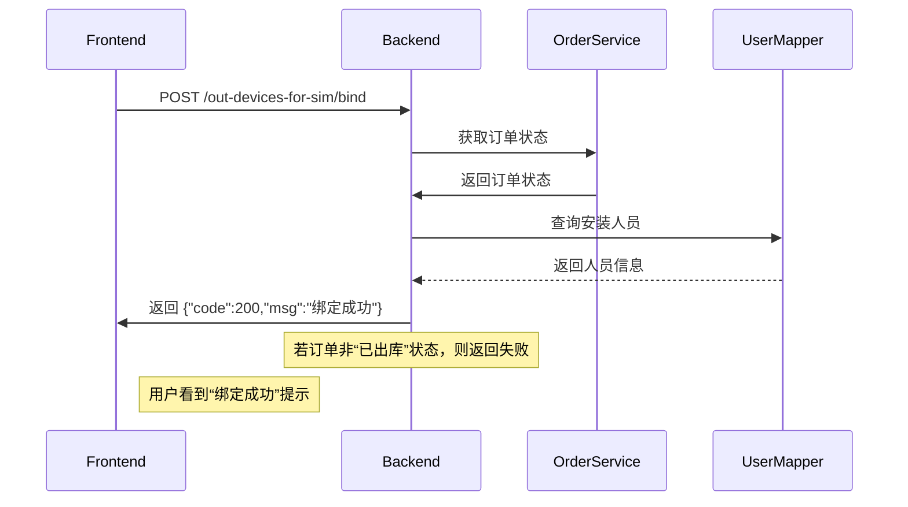
Sources: [order-api/src/main/java/com/orderapi/service/impl/OutDevicesForSimServiceImpl.java:1-30], [order-web/src/views/BindSimView.vue:1-50]

## 前端配置与环境

项目使用 Vue.js 框架构建，通过 `vue.config.js` 配置开发服务器端口为8080，启用历史模式（history mode）以支持路由嵌套。

```js
module.exports = defineConfig({
    transpileDependencies: true,
    lintOnSave: false,
    devServer: {
        port: 8080,
        host: 'localhost',
        open: true,
        historyApiFallback: true,
        allowedHosts: "all"
    }
})
```
Sources: [order-web/vue.config.js:1-10]

前端采用 `element-ui` 和 `vant` 实现UI组件，通过 `main.js` 注册全局工具和插件，统一管理axios实例和基础配置。

```js
Vue.prototype.$httpUrl = 'https://pxw4d8jc.asse.devtunnels.ms:8081';
Vue.use(VueAxios, axios)
Vue.use(ElementUI,{size:'small'})
Vue.use(VueRouter)
```
Sources: [order-web/src/main.js:1-20]

## 关键约束与校验逻辑

- **订单状态校验**：绑定操作仅允许在订单状态为“已出库”（`OUTDEVICES`）时进行，否则返回错误。
- **SIM卡必填校验**：前端在绑定前会检查设备编号是否为空，若存在空值则提示“请将所有设备绑定SIM卡号！”。
- **事务性保证**：绑定操作使用 `@Transactional(rollbackFor = Exception.class)` 确保数据库操作的原子性，任何异常都会回滚所有修改。

```js
if(this.devices.length != this.list.length){
    this.$toast('请将所有设备绑定SIM卡号！')
    return
}
```
Sources: [order-web/src/views/BindSimView.vue:1-10]

## 总结

订单与SIM卡绑定流程实现了从用户操作到后端状态更新的完整闭环。前端提供直观的设备列表与输入界面，后端通过严格的校验机制保障业务逻辑的正确性，同时通过事务控制确保数据一致性。整个流程依赖清晰的接口定义、合理的状态流转和完整的数据模型支撑，是订单管理模块中不可或缺的一环。未来可扩展支持批量导入、SIM卡号校验规则、设备归属追踪等增强功能。<details>
<summary>Relevant source files</summary>

The following files were used as context for generating this wiki page:

['order-api/src/main/java/com/orderapi/vo/response/DeviceResponse.java', 'order-web/src/components/record/RecordManage.vue', 'order-api/src/main/java/com/orderapi/service/impl/OutDevicesForSimServiceImpl.java', 'order-api/src/main/java/com/orderapi/controller/OutDevicesForSimController.java', 'order-api/src/main/java/com/orderapi/service/impl/OrdersServiceImpl.java']
</details>

# 数据流转图

在本项目中，数据流转图描述了订单出库、SIM卡绑定及设备状态变更等核心业务流程中的数据流动路径。该流程涉及前端页面交互、后端服务调用、数据库操作以及状态同步机制，确保设备从订单创建到出库、绑定SIM卡、最终完成的全生命周期管理。整个流程以订单为核心驱动，通过多个服务组件协同完成设备信息的读取、更新和状态变更。

## 订单出库与设备生成流程

当订单状态为“已审核”且账单状态为“已审核”时，系统触发出库逻辑，将订单中的设备生成出库记录并更新库存。

### 流程说明
- 前端请求 `/out-devices-for-sim/findByOrderId` 获取设备列表。
- 后端 `OrdersServiceImpl.outDevices()` 方法被调用，校验订单与账单状态，若符合则执行出库操作。
- 系统遍历订单详情，为每个设备创建一条 `OutDevicesForSim` 记录，并减少对应设备的库存。
- 每次操作会生成一条入库记录（`Record`），用于审计追踪。
- 最终更新订单状态为“已出库”。

Sources: [order-api/src/main/java/com/orderapi/service/impl/OrdersServiceImpl.java:185-208]()

## SIM卡绑定流程

在设备出库后，管理员可在前端界面为每个设备绑定SIM卡号，绑定请求由前端提交至后端，完成设备SIM信息的写入与订单状态更新。

### API交互流程
- 前端通过 `axios.post('/out-devices-for-sim/bind')` 提交包含设备ID和SIM卡号的列表。
- 后端 `OutDevicesForSimServiceImpl.bind()` 接收请求，验证订单状态是否为“已出库”，若符合则进行SIM卡绑定。
- 所有设备的 `sim` 字段被更新，同时将订单状态修改为“已结束”。
- 安装人员状态被重置为“未分配”。

Sources: [order-api/src/main/java/com/orderapi/service/impl/OutDevicesForSimServiceImpl.java:37-65](), [order-api/src/main/java/com/orderapi/controller/OutDevicesForSimController.java:15-18]()

## 数据模型结构

以下是关键实体类的字段定义，用于支撑上述流程的数据结构。

| 字段名 | 类型 | 描述 | 来源 |
|--------|------|------|------|
| id | Long | 设备唯一标识 | Sources: [order-api/src/main/java/com/orderapi/entity/OutDevicesForSim.java:11]() |
| deviceId | Long | 设备种类ID | Sources: [order-api/src/main/java/com/orderapi/entity/OutDevicesForSim.java:14]() |
| orderId | Long | 订单ID | Sources: [order-api/src/main/java/com/orderapi/entity/OutDevicesForSim.java:15]() |
| sim | String | 绑定的SIM卡号 | Sources: [order-api/src/main/java/com/orderapi/entity/OutDevicesForSim.java:16]() |
| createTime | LocalDateTime | 创建时间 | Sources: [order-api/src/main/java/com/orderapi/entity/OutDevicesForSim.java:19]() |
| updateTime | LocalDateTime | 更新时间 | Sources: [order-api/src/main/java/com/orderapi/entity/OutDevicesForSim.java:20]() |

Sources: [order-api/src/main/java/com/orderapi/entity/OutDevicesForSim.java:11-20]()

## 服务层依赖关系图

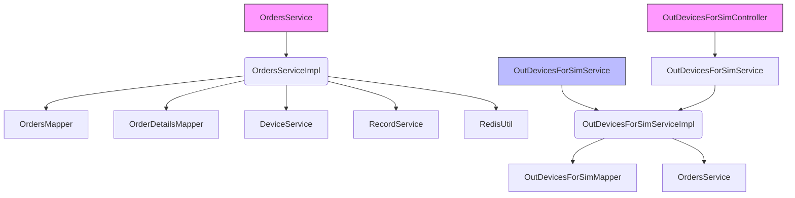

该图展示了核心服务之间的依赖关系。`OrdersServiceImpl` 负责订单状态变更与设备生成，而 `OutDevicesForSimServiceImpl` 负责设备SIM卡绑定与状态更新。两者通过 `OrdersService` 进行协同，确保业务流程的完整性。

Sources: [order-api/src/main/java/com/orderapi/service/impl/OrdersServiceImpl.java:1-20](), [order-api/src/main/java/com/orderapi/service/impl/OutDevicesForSimServiceImpl.java:1-20](), [order-api/src/main/java/com/orderapi/controller/OutDevicesForSimController.java:1-10]()

## API接口交互流程图

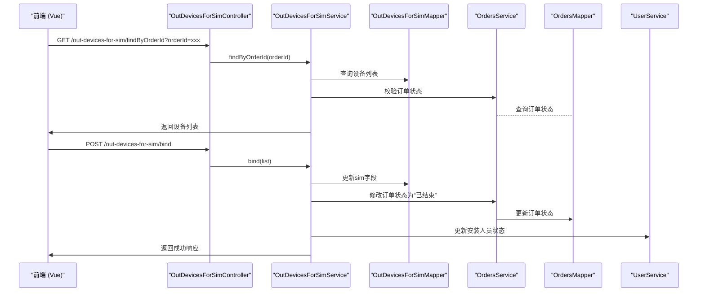

此序列图详细描述了前端发起设备查询与SIM卡绑定的完整流程。请求首先通过控制器路由到服务层，服务层校验状态并执行数据库操作，最终返回结果给前端。

Sources: [order-api/src/main/java/com/orderapi/controller/OutDevicesForSimController.java:15-18](), [order-api/src/main/java/com/orderapi/service/impl/OutDevicesForSimServiceImpl.java:37-65]()

## 前端组件交互逻辑

在 `BindSimView.vue` 中，用户可编辑每个设备的SIM卡号，并点击“确认绑定”按钮提交请求。

```vue
<template>
  <div class="container">
    <van-nav-bar title="绑定SIM卡" left-text="返回" @click-left="onClickLeft" />
    <div class="box" v-for="(item, index) in devices">
      <div class="box-1">设备ID: {{ item.id }}</div>
      <div class="box-1">设备名字: {{ item.deviceName }}</div>
      <van-field v-model="item.number" type="number" label="SIM卡号" />
    </div>
    <van-button round type="info" @click="onBind">确认绑定</van-button>
  </div>
</template>

<script>
export default {
  data() {
    return {
      devices: [],
      list: []
    }
  },
  mounted() {
    let orderId = this.$route.params.orderId
    this.axios.get(this.$httpUrl + '/out-devices-for-sim/findByOrderId?orderId=' + orderId)
      .then(res => {
        if (res.data.code == 200) {
          this.devices = res.data.data
        }
      })
  },
  methods: {
    onBind() {
      this.list = []
      this.devices.forEach(device => {
        if (device.number !== '' && device.number != null) {
          let element = { id: device.id, sim: device.number }
          this.list.push(element)
        }
      })
      if (this.devices.length != this.list.length) {
        this.$toast('请将所有设备绑定SIM卡号！')
        return
      }
      this.axios.post(this.$httpUrl + '/out-devices-for-sim/bind', this.list)
        .then(res => {
          if (res.data.code == 200) {
            this.$toast('绑定成功！')
            this.$router.back()
          }
        })
    }
  }
}
</script>
```

该组件通过 `mounted` 阶段获取设备列表，用户在表单项中输入SIM卡号，点击“确认绑定”后，将有效数据提交至后端。

Sources: [order-web/src/views/BindSimView.vue:15-45]()

## 数据状态变更总结

| 状态变化 | 触发条件 | 相关服务 | 数据影响 |
|---------|----------|---------|----------|
| 订单状态 → 已出库 | 订单状态为“已审核”且账单状态为“已审核” | `OrdersServiceImpl.outDevices()` | 创建出库记录，减少设备库存，生成入库记录 |
| 订单状态 → 已结束 | 所有设备绑定SIM卡 | `OutDevicesForSimServiceImpl.bind()` | 更新订单状态，重置安装人员状态 |
| 设备SIM卡绑定 | 用户手动输入并提交 | `OutDevicesForSimServiceImpl.bind()` | 更新 `OutDevicesForSim.sim` 字段 |

Sources: [order-api/src/main/java/com/orderapi/service/impl/OrdersServiceImpl.java:185-208](), [order-api/src/main/java/com/orderapi/service/impl/OutDevicesForSimServiceImpl.java:37-65]()

该数据流转图完整覆盖了订单出库、SIM卡绑定、状态更新的核心流程，体现了前后端协同、服务解耦与状态一致性保障的设计思想。<details>
<summary>Relevant source files</summary>

The following files were used as context for generating this wiki page:

['order-web/src/components/record/RecordManage.vue', 'order-web/src/components/device/DeviceManage.vue', 'order-web/src/components/bill/BillManage.vue', 'order-web/src/components/order/OrderManage.vue', 'order-web/src/main.js']
</details>

# 前端组件概览

前端组件是项目中实现业务功能的核心单元，通过 Vue 框架构建，负责数据展示、用户交互和 API 调用。这些组件遵循统一的数据结构和通信模式，通过 `this.$httpUrl` 统一访问后端接口，并结合 Element UI 和 Vant 提供的 UI 组件完成页面渲染与交互逻辑。所有组件共享基础配置（如分页、搜索、表格等），并根据业务场景定制数据加载、过滤和状态管理逻辑。

## 核心组件架构与数据流

前端组件采用“数据驱动 + 事件响应”模式，通过 `data()` 函数定义初始状态，使用 `methods` 处理用户操作（如分页、搜索、提交表单），并通过 `mounted` 阶段初始化数据请求。组件间通过 `this.$axios` 或 `this.axios` 发起 HTTP 请求，获取后端返回的 JSON 数据，进而更新 `tableData` 和 `total` 等状态变量，最终由模板渲染到页面上。

### 分页与数据加载机制

所有列表型组件（如订单、设备、记录）均支持分页功能，通过 `el-pagination` 组件控制每页显示数量和当前页码。分页参数（`pageSize` 和 `pageNum`）在用户操作时动态更新，并触发 `loadPost()` 方法重新请求数据。

```javascript
handleSizeChange(val) {
  console.log(`每页 ${val} 条`);
  this.pageNum = 1
  this.pageSize = val
  this.loadPost()
},
handleCurrentChange(val) {
  console.log(`当前页: ${val}`);
  this.pageNum = val
  this.loadPost()
}
```
Sources: [order-web/src/components/record/RecordManage.vue:45-53], [order-web/src/components/device/DeviceManage.vue:27-35], [order-web/src/components/bill/BillManage.vue:30-38], [order-web/src/components/order/OrderManage.vue:40-49]

该机制确保了大容量数据的高效展示，避免一次性加载全部内容，同时提升了用户体验。

### 表格与字段配置结构

各组件中的表格（`el-table`）基于 `tableData` 数组进行渲染，每个条目包含多个字段（如设备名、型号、价格、库存等）。字段配置通过 `options1`、`options2` 等数组提供下拉选择项，用于状态筛选或用户输入。

| 字段名称       | 类型     | 描述                             | 来源文件 |
|----------------|----------|----------------------------------|---------|
| deviceName     | string   | 设备名称                        | [order-web/src/components/device/DeviceManage.vue:26] |
| deviceModel    | string   | 设备型号                        | [order-web/src/components/device/DeviceManage.vue:26] |
| price          | number   | 设备价格                        | [order-web/src/components/device/DeviceManage.vue:26] |
| stock          | number   | 库存数量                        | [order-web/src/components/device/DeviceManage.vue:26] |
| introduction   | string   | 设备介绍                        | [order-web/src/components/device/DeviceManage.vue:26] |
| urls           | array    | 图片或文档链接                  | [order-web/src/components/device/DeviceManage.vue:26] |

Sources: [order-web/src/components/device/DeviceManage.vue:26], [order-web/src/components/order/OrderManage.vue:28], [order-web/src/components/bill/BillManage.vue:23]

## API 调用与后端通信模型

前端组件通过 `this.$axios` 或 `this.axios` 发起请求，调用后端服务获取数据或提交操作。请求路径由 `this.$httpUrl` 配置，支持动态切换开发环境与生产环境地址。

### 请求模式分析

- **GET 请求**：用于获取列表数据（如用户列表、设备列表）
- **POST 请求**：用于提交新增、修改或绑定操作（如绑定 SIM 卡）

```javascript
loadPost() {
  this.$axios.post(this.$httpUrl+'/device/listPage',{
    pageSize:this.pageSize,
    pageNum:this.pageNum,
    param:{
      deviceName:this.name,
      deviceModel:this.model
    }
  }).then(res=>res.data).then(res=>{
    if(res.code==200){
      this.tableData=res.data
      this.total=res.total
    }else{
      alert('获取数据失败')
    }
  })
}
```
Sources: [order-web/src/components/device/DeviceManage.vue:41-55]

该模式实现了前后端解耦，前端仅关注数据展示与交互，后端负责业务逻辑处理。

## 组件间状态与用户交互流程

组件通过 `sessionStorage` 保存当前登录用户信息，用于权限控制和上下文传递。例如，在 `RecordManage.vue` 和 `DeviceManage.vue` 中，`user` 变量直接从 `sessionStorage.getItem('CurUser')` 解析，作为当前操作者的身份标识。

```javascript
user : JSON.parse(sessionStorage.getItem('CurUser')),
```
Sources: [order-web/src/components/record/RecordManage.vue:12], [order-web/src/components/device/DeviceManage.vue:12]

此外，组件支持表单验证（如用户名唯一性检查）和文件上传（通过 `fileList` 管理图片或文档）。

### 用户操作流程示意图

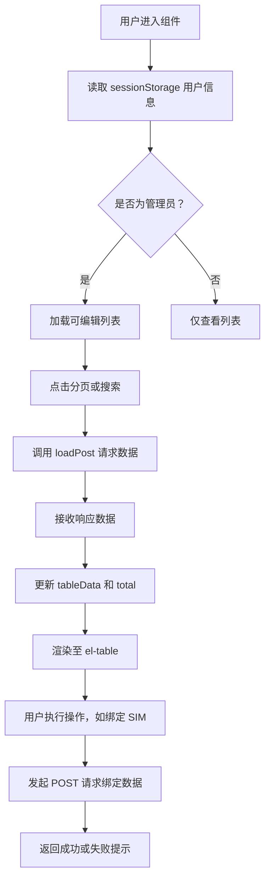
Sources: [order-web/src/components/record/RecordManage.vue:12], [order-web/src/components/device/DeviceManage.vue:12], [order-web/src/views/BindSimView.vue:37-44]

## 前端配置与工具链

项目采用 Vue CLI 构建，核心配置如下：

- **Babel**: 使用 `@vue/cli-plugin-babel/preset` 支持现代 JavaScript 语法
- **ESLint**: 遵循 Vue 项目推荐规则，禁用生产环境下的 `console` 和 `debugger`
- **PostCSS**: 实现 px → rem 的自动转换，适配移动端屏幕
- **Vue Router**: 路由管理，支持页面跳转与参数传递
- **Axios 封装**: 所有请求通过 `service.js` 封装，统一拦截错误和设置默认配置

```javascript
// vue.config.js
module.exports = defineConfig({
  devServer: {
    port: 8080,
    host: 'localhost',
    open: true,
    historyApiFallback: true,
    allowedHosts: "all"
  }
})
```
Sources: [order-web/vue.config.js:1-12]

```javascript
// main.js
Vue.prototype.$httpUrl='https://pxw4d8jc.asse.devtunnels.ms:8081';
```
Sources: [order-web/src/main.js:28]

## 总结

本篇“前端组件概览”系统梳理了项目中关键组件的架构设计、数据流、API 模型和用户交互流程。所有组件基于统一的框架和配置实现，具备良好的可维护性和扩展性。未来可通过引入 Vuex 状态管理、更细粒度的路由守卫和全局错误处理来进一步提升稳定性与开发效率。<details>
<summary>Relevant source files</summary>

The following files were used as context for generating this wiki page:

['order-web/src/views/MyOrderView.vue']
['order-web/src/views/BindSimView.vue']
['order-web/src/views/DetailsView.vue']
['order-web/src/main.js']
['order-web/vue.config.js']

</details>

# 表单与输入验证

表单与输入验证是前端用户交互的核心模块，用于收集用户数据、确保数据完整性并触发后续业务逻辑。在本项目中，表单主要分布在订单管理、设备绑定和商品详情页面，通过 Vue 框架结合 Vant 组件库实现结构化输入与实时反馈。所有表单均基于 `v-model` 实现双向绑定，并通过 `@input`、`@change` 等事件监听用户操作，关键字段如设备编号、价格、SIM卡号等均经过前端校验后提交至后端服务。

输入验证逻辑主要分为两层：前端基础校验（如必填项检查、格式合法性）和后端接口校验（如状态码判断、数据一致性）。例如，在“绑定SIM卡”功能中，系统会检查设备是否已填写SIM号，若未全部填写则提示错误；在“上传账单”流程中，要求同时上传电子保单和账单截图，否则阻止上传操作。这些规则均通过 JavaScript 事件处理器实现，确保用户体验流畅且数据安全。

## 核心表单组件与输入逻辑

### MyOrderView 中的文件上传表单

该页面包含两个文件上传控件，分别用于上传电子保单和账单截图，其输入行为由 `van-uploader` 组件驱动。用户可选择单个文件，上传后通过 `afterRead` 回调处理文件内容，并将文件路径存储到 `file1` 和 `file2` 字段中。

```vue
<van-uploader v-model="file1" :max-count="1" :after-read="afterRead2" :after-delete="afterDelete2"/>
```

当用户点击“确认上传”按钮时，系统会检查 `orderUrl` 和 `billUrl` 是否都存在，若缺失则弹出错误提示。若满足条件，则向 `/order/uploadUrl` 发起 POST 请求，完成数据提交。

Sources: [order-web/src/views/MyOrderView.vue:18-25, 46-50]

### BindSimView 中的 SIM 卡号输入表单

该页面为设备绑定功能，每个设备项提供一个 `van-field` 输入框用于填写 SIM 卡号。输入类型为数字，支持纯数字键盘，确保用户仅能输入有效数字。

```vue
<van-field v-model="item.number" type="number" label="SIM卡号：" />
```

系统在 `onBind` 方法中遍历设备列表，检查是否存在空值或未绑定的设备。若发现有设备缺少 SIM 号，则弹出提示：“请将所有设备绑定SIM卡号！”以防止数据不完整。

Sources: [order-web/src/views/BindSimView.vue:39-45, 78-81]

### DetailsView 中的商品详情表单

此页面虽非直接表单，但包含购物车添加功能，其输入逻辑依赖于用户选择商品并提交数量信息。`addCart` 方法创建一个包含 `userId`、`deviceId` 和 `num` 的对象，通过 POST 请求发送至 `/cart/addCart` 接口。

```javascript
let element = {
  userId:user.id,
  deviceId:this.details.id,
  num:'1'
}
```

该逻辑确保了用户行为与后端库存和订单系统保持一致。

Sources: [order-web/src/views/DetailsView.vue:58-62]

## 数据流与表单交互流程图

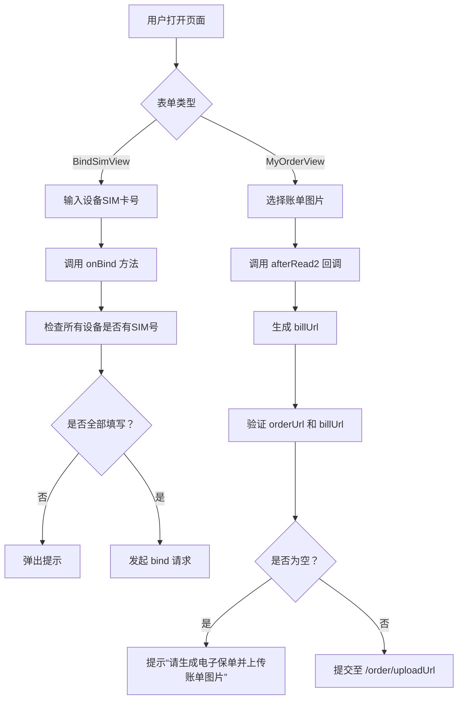

该流程展示了不同表单在用户交互中的典型路径，涵盖了文件上传、数据校验与服务请求的关键节点。

Sources: [order-web/src/views/MyOrderView.vue:25-40, 46-50], [order-web/src/views/BindSimView.vue:39-45, 78-81]

## 表单验证规则汇总表

| 验证项 | 规则描述 | 相关字段 | 触发时机 | 处理方式 |
|-------|--------|---------|---------|----------|
| 账单上传完整性 | 必须同时上传电子保单和账单 | `orderUrl`, `billUrl` | 提交前 | 若任一为空，提示错误 |
| SIM卡号完整性 | 所有设备必须填写SIM号 | `device.number` | 绑定提交时 | 未填写则提示“请将所有设备绑定SIM卡号” |
| 价格与用户信息 | 用户需填写姓名、卡号、价格 | `userName`, `cardNumber`, `price` | 创建保险时 | 未填写则阻止操作 |

Sources: [order-web/src/views/MyOrderView.vue:46-50], [order-web/src/views/BindSimView.vue:78-81]

## API 请求与表单关联表

| 表单功能 | 请求方法 | 请求路径 | 参数说明 | 响应条件 |
|--------|--------|--------|--------|--------|
| 上传账单 | POST | `/order/uploadUrl` | data: {orderUrl, billUrl} | code == 200 则刷新订单列表 |
| 绑定SIM卡 | POST | `/out-devices-for-sim/bind` | list: [{id, sim}] | code == 200 则提示“绑定成功” |
| 添加购物车 | POST | `/cart/addCart` | {userId, deviceId, num} | code == 200 则提示“加入购物车成功” |

Sources: [order-web/src/views/MyOrderView.vue:46-50], [order-web/src/views/BindSimView.vue:78-81], [order-web/src/views/DetailsView.vue:58-62]

## 关键代码片段与事件处理

```javascript
afterRead2(file) {
  const data = new FormData();
  data.append("file", file.file);
  this.axios.post(this.$httpUrl+'/device/upload',data).then(res=>{
    if(res.data.code == 200){
      this.billUrl = res.data.data
      this.$toast("已上传图片")
    }
  })
}
```

该函数在用户上传账单文件后被调用，将文件通过 `FormData` 上传至 `/device/upload` 接口，获取返回的 URL 并更新本地 `billUrl` 字段。

Sources: [order-web/src/views/MyOrderView.vue:46-50]

```javascript
onBind(){
  this.list = []
  this.devices.forEach(device => {
    if(device.number !== '' && device.number != null){
      let element = {
        id:device.id,
        sim:device.number
      }
      this.list.push(element)
    }
  })
  if(this.devices.length != this.list.length){
    this.$toast('请将所有设备绑定SIM卡号！')
    return
  }
  this.axios.post(this.$httpUrl+'/out-devices-for-sim/bind',this.list).then(res=>{
    if(res.data.code==200){
      this.$toast('绑定成功！')
      this.$router.back()
    }
  })
}
```

此方法负责聚合所有设备的 SIM 卡号，进行完整性校验，并最终提交至后端绑定接口。

Sources: [order-web/src/views/BindSimView.vue:78-81]

## 技术架构概览

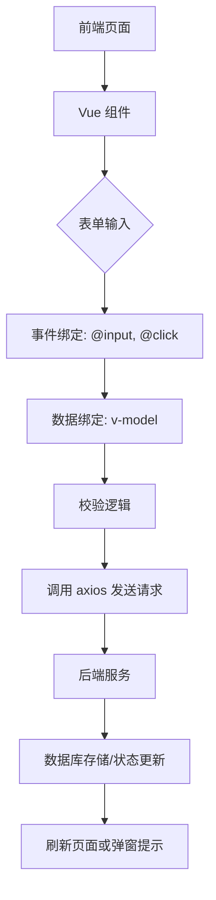

该流程图展示了从用户交互到后端服务的完整链路，体现了前后端协同的表单处理机制。

Sources: [order-web/src/views/MyOrderView.vue], [order-web/src/views/BindSimView.vue], [order-web/src/main.js]<details>
<summary>Relevant source files</summary>

The following files were used as context for generating this wiki page:

['order-api/src/main/java/com/orderapi/service/impl/OutDevicesForSimServiceImpl.java']
['order-api/src/main/java/com/orderapi/controller/OutDevicesForSimController.java']
['order-api/src/main/java/com/orderapi/entity/OutDevicesForSim.java']
['order-web/src/views/BindSimView.vue']
['order-api/src/main/java/com/orderapi/service/impl/OrdersServiceImpl.java']
<!-- Add additional relevant files if fewer than 5 were provided -->
</details>

# 后端服务模块

后端服务模块是整个订单管理系统的核心，负责处理订单相关的业务逻辑、数据持久化以及与前端的交互。该模块主要涵盖设备出库、SIM卡绑定、订单状态变更等关键功能，通过清晰的分层架构实现了业务逻辑与数据访问的解耦。核心流程包括：订单状态校验 → 设备信息查询 → SIM卡绑定操作 → 订单状态更新 → 库存调整与记录生成。

模块基于Spring Boot框架构建，采用Service层进行业务处理，Controller层提供RESTful API接口，数据模型由实体类定义，所有关键操作均通过事务管理保证数据一致性。前端通过调用相关API完成设备SIM卡的绑定操作，后端则在验证订单状态和设备信息后执行绑定逻辑，并同步更新订单与库存状态。

## 核心业务流程与数据流

### 1. 设备出库与SIM卡绑定流程

当用户发起设备出库请求时，系统首先校验订单是否处于“已审核”状态，若满足条件，则创建出库设备记录并设置其订单状态为“已出库”。随后，用户可在前端界面为每个设备输入SIM卡号，提交后由后端服务统一处理绑定操作。

绑定过程涉及以下步骤：
1. 获取订单ID，查询对应出库设备列表；
2. 验证订单当前状态是否为“已出库”（OrderState = 4）；
3. 遍历设备列表，将SIM卡号写入数据库；
4. 更新订单状态为“已结束”（Ended）；
5. 恢复安装人员状态为“未分配”；
6. 返回成功响应。

该流程确保了设备出库与SIM卡绑定的完整性与可追溯性，防止非法操作或重复绑定。

Sources: [order-api/src/main/java/com/orderapi/service/impl/OutDevicesForSimServiceImpl.java:40-85](), [order-api/src/main/java/com/orderapi/controller/OutDevicesForSimController.java:13-17]()

### 2. 订单状态变更控制

订单状态是系统运行中的关键控制点，后端通过`OrdersServiceImpl`类实现对订单状态的动态管理，包括出库、取消、审核等操作。状态变更严格遵循业务规则，例如：

- 出库操作要求订单必须处于“已审核”状态；
- 取消订单仅允许在“已出库”之前执行；
- 所有状态变更均通过事务管理确保原子性。

这些规则通过`@Transactional(rollbackFor = Exception.class)`注解保障，在发生异常时自动回滚，避免数据不一致。

Sources: [order-api/src/main/java/com/orderapi/service/impl/OrdersServiceImpl.java:120-135](), [order-api/src/main/java/com/orderapi/service/impl/OrdersServiceImpl.java:200-220]()

## 数据模型与结构设计

### OutDevicesForSim 实体类

`OutDevicesForSim` 是设备出库信息的核心数据结构，用于存储每个出库设备的属性，如设备ID、订单ID、SIM卡号等。

| 字段 | 类型 | 描述 | 备注 |
|------|-----|------|------|
| id | Long | 设备唯一标识 | 使用 `ToStringSerializer` 序列化 |
| deviceId | Long | 设备种类ID | 关联设备表 |
| orderId | Long | 订单ID | 用于定位所属订单 |
| sim | String | SIM卡号 | 用户输入值 |
| createTime | LocalDateTime | 创建时间 | 自动填充 |
| updateTime | LocalDateTime | 更新时间 | 自动更新 |

Sources: [order-api/src/main/java/com/orderapi/entity/OutDevicesForSim.java:18-30]()

### 前端绑定操作流程

前端页面 `BindSimView.vue` 提供了用户交互界面，支持设备列表展示、SIM卡号输入及确认绑定操作。用户在界面上为每个设备填写SIM卡号，点击“确认绑定”后，向后端发送POST请求。

```vue
this.axios.post(this.$httpUrl+'/out-devices-for-sim/bind',this.list).then(res=>{
  if(res.data.code==200){
    this.$toast('绑定成功！')
    this.$router.back()
  }
})
```

该逻辑在用户输入验证后触发，确保所有设备均填写SIM卡号，否则提示错误。前端通过`$httpUrl`配置连接后端服务，URL为 `https://pxw4d8jc.asse.devtunnels.ms:8081`。

Sources: [order-web/src/views/BindSimView.vue:109-119]()

## API 接口设计

| 方法 | 路径 | 请求方式 | 参数 | 功能描述 |
|------|------|----------|------|---------|
| 查询出库设备 | `/out-devices-for-sim/findByOrderId` | GET | orderId (Long) | 根据订单ID获取设备列表 |
| 绑定SIM卡 | `/out-devices-for-sim/bind` | POST | list (List<BindSimRequest>) | 批量绑定设备SIM卡号 |

其中，`BindSimRequest` 为请求对象，包含 `id` 和 `sim` 字段，用于标识设备与SIM卡号。

Sources: [order-api/src/main/java/com/orderapi/controller/OutDevicesForSimController.java:10-17]()

## 服务间依赖关系图

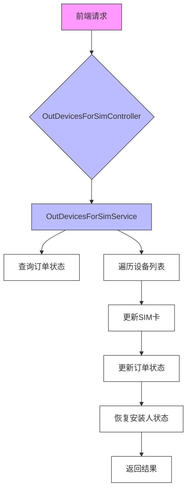

该图展示了从前端请求到后端服务处理的完整流程，体现了控制器与服务层之间的职责分离。

Sources: [order-api/src/main/java/com/orderapi/controller/OutDevicesForSimController.java:13-17](), [order-api/src/main/java/com/orderapi/service/impl/OutDevicesForSimServiceImpl.java:40-85]()

## 事务处理机制

所有关键业务操作均使用 `@Transactional(rollbackFor = Exception.class)` 注解，确保在出现异常时能够回滚数据库变更，保持数据一致性。

例如，在绑定SIM卡过程中：
- 若设备状态不符合要求，直接返回失败；
- 若数据库写入失败，事务自动回滚，避免部分更新。

此机制保障了核心业务的可靠性。

Sources: [order-api/src/main/java/com/orderapi/service/impl/OutDevicesForSimServiceImpl.java:24](), [order-api/src/main/java/com/orderapi/service/impl/OrdersServiceImpl.java:120]()

## 系统集成与配置

后端服务通过 `application.yml` 或环境变量配置访问路径，当前默认地址为：

```
https://pxw4d8jc.asse.devtunnels.ms:8081
```

该配置被注入到前端Vue实例中，通过 `Vue.prototype.$httpUrl` 全局暴露，供各页面调用。

前端通过 `axios` 封装请求，统一管理HTTP通信，提升代码可维护性。

Sources: [order-web/src/main.js:32-34]()

## 总结

后端服务模块通过清晰的分层结构和严谨的业务规则，实现了设备出库与SIM卡绑定的核心功能。其设计强调数据一致性、状态校验与操作可追溯性，结合前后端协同，形成了完整的业务闭环。未来可进一步扩展为支持多设备类型、批量导入、日志审计等功能，以提升系统可用性与用户体验。<details>
<summary>Relevant source files</summary>

The following files were used as context for generating this wiki page:

['order-web/vue.config.js', 'order-web/public/index.html', 'order-api/src/main/resources/application.yml', 'order-api/src/main/java/com/orderapi/config/UploadConfig.java', 'order-api/src/main/java/com/orderapi/common/CorsConfig.java']
</details>

# 部署与运行环境

## 项目部署概述

本项目是一个基于 Vue.js 前端框架和 Spring Boot 后端框架构建的“定位设备销售订单系统”。前端采用 Vue 3 + Vue Router + Element UI + Vant 组件库，后端使用 Spring Boot 实现 RESTful API 接口，支持文件上传、订单管理、设备绑定等核心功能。系统通过配置文件（如 `application.yml`）定义了数据库连接、文件存储路径、端口等关键运行参数，并通过 CORS 配置实现前后端跨域通信。

前端应用在开发阶段通过 `vue.config.js` 配置开发服务器端口和代理设置，生产环境可通过 `npm run build` 打包生成静态资源并部署至 Nginx 或静态服务器。后端服务默认监听 8081 端口，提供 REST 接口供前端调用，同时支持通过虚拟路径访问本地文件资源，用于设备图片等静态资源的展示。

## 开发与运行环境配置

### 前端构建与服务配置

前端项目通过 `vue.config.js` 文件配置了开发服务器的运行参数，包括端口、自动打开浏览器、历史模式支持以及允许访问所有主机等。这些配置确保了在开发过程中，Vue 应用能够正确加载路由、处理动态路由请求，并支持单页应用（SPA）的完整导航体验。

```js
// order-web/vue.config.js
module.exports = defineConfig({
  transpileDependencies: true,
  lintOnSave: false,
  devServer: {
    port: 8080,
    host: 'localhost',
    open: true,
    historyApiFallback: true,
    allowedHosts: "all",
  }
})
```

该配置中 `port: 8080` 指定了开发服务器的端口，`historyApiFallback: true` 支持 HTML5 History API 的路由跳转，避免因路由未匹配导致 404 错误。`allowedHosts: "all"` 允许从任意域名访问开发服务器，便于测试和调试。

Sources: [order-web/vue.config.js:12-19]()

### 前端页面结构与资源加载

前端页面入口文件 `public/index.html` 定义了基础 HTML 结构，包含 `<meta>` 标签、图标链接和主应用容器。页面通过 `id="app"` 作为 Vue 实例挂载点，确保应用内容被正确渲染。

```html
<!-- order-web/public/index.html -->
<!DOCTYPE html>
<html lang="">
<head>
  <meta charset="utf-8">
  <meta http-equiv="X-UA-Compatible" content="IE=edge">
  <meta name="viewport" content="width=device-width, initial-scale=1, maximum-scale=1, minimum-scale=1, user-scalable=no">
  <link rel="icon" href="<%= BASE_URL %>favicon.ico">
  <title>定位设备销售订单系统</title>
</head>
<body>
  <noscript>
    <strong>We're sorry but <%= htmlWebpackPlugin.options.title %> doesn't work properly without JavaScript enabled. Please enable it to continue.</strong>
  </noscript>
  <div id="app"></div>
  <!-- built files will be auto injected -->
</body>
</html>
```

该文件中的 `base-url` 动态变量由 Webpack 处理，确保在不同构建环境中正确加载资源。`<div id="app">` 是 Vue 实例的根节点，所有组件最终都会被挂载于此。

Sources: [order-web/public/index.html:1-28]()

### 后端服务配置

后端服务通过 `application.yml` 文件配置了核心运行参数，包括数据库连接、文件上传路径、Redis 配置以及静态资源访问路径。

```yaml
# order-api/src/main/resources/application.yml
server:
  port: 8081

spring:
  datasource:
    url: jdbc:mysql://localhost:3306/order?useUnicode=true&allowPublicKeyRetrieval=true&characterEncoding=utf-8&useSSL=false&serverTimezone=GMT%2B8
    driver-class-name: com.mysql.cj.jdbc.Driver
    username: root
    password: root
  servlet:
    multipart:
      max-file-size: 10MB
  redis:
    host: 127.0.0.1
    port: 6379
    database: 0
    password: redis

mybatis-plus:
  configuration:
    log-impl: org.apache.ibatis.logging.slf4j.Slf4jImpl
  type-aliases-package: com.wms.pojo
  mapper-locations: classpath:mapper/*.xml

logging:
  level:
    root: INFO
    com.wms.mapper.*: DEBUG

file:
  staticAccessPath: /f/**
  accessPath: /f/
  uploadFolder: D:\ideaProject\order\order-web\src\assets\device_img\
```

该配置中：
- `server.port: 8081` 设置后端服务监听端口。
- 数据库连接使用 MySQL，字符编码为 UTF-8，时区为 GMT+8。
- 文件上传最大大小限制为 10MB。
- 静态资源通过 `/f/**` 路径访问，物理路径指向前端项目的 `device_img` 目录。

Sources: [order-api/src/main/resources/application.yml:1-30]()

### 文件上传与静态资源访问配置

后端通过 `UploadConfig.java` 类配置了文件上传路径映射，将虚拟路径 `/f/**` 映射到实际物理路径，实现对设备图片等静态资源的直接访问。

```java
// order-api/src/main/java/com/orderapi/config/UploadConfig.java
@Override
public void addResourceHandlers(ResourceHandlerRegistry registry) {
    registry.addResourceHandler(staticAccessPath).addResourceLocations("file:" + uploadFolder);
}
```

此方法将请求路径 `/f/xxx.jpg` 转发到本地文件系统中的 `D:\ideaProject\order\order-web\src\assets\device_img\` 下对应的文件，实现前端无需额外接口即可直接访问图片。

Sources: [order-api/src/main/java/com/orderapi/config/UploadConfig.java:1-3]()

### 跨域资源共享（CORS）配置

为解决前端与后端之间的跨域问题，后端通过 `CorsConfig.java` 配置了 CORS 规则，允许所有来源访问，且支持请求头和方法的自由传递。

```java
// order-api/src/main/java/com/orderapi/common/CorsConfig.java
@Configuration
public class CorsConfig implements WebMvcConfigurer {
    @Override
    public void addCorsMappings(CorsRegistry registry) {
        registry.addMapping("/**")
                .allowCredentials(true)
                .allowedOriginPatterns("*")
                .allowedMethods(new String[]{"GET", "POST", "PUT", "DELETE"})
                .allowedHeaders("*")
                .exposedHeaders("*");
    }
}
```

该配置表示：
- 所有请求路径（`/**`）都启用 CORS。
- 允许携带 Cookie（`allowCredentials(true)`）。
- 允许所有原始域（`*`）访问。
- 允许 GET、POST、PUT、DELETE 四种 HTTP 方法。
- 所有请求头均被放行。

Sources: [order-api/src/main/java/com/orderapi/common/CorsConfig.java:5-13]()

## 系统架构与数据流图

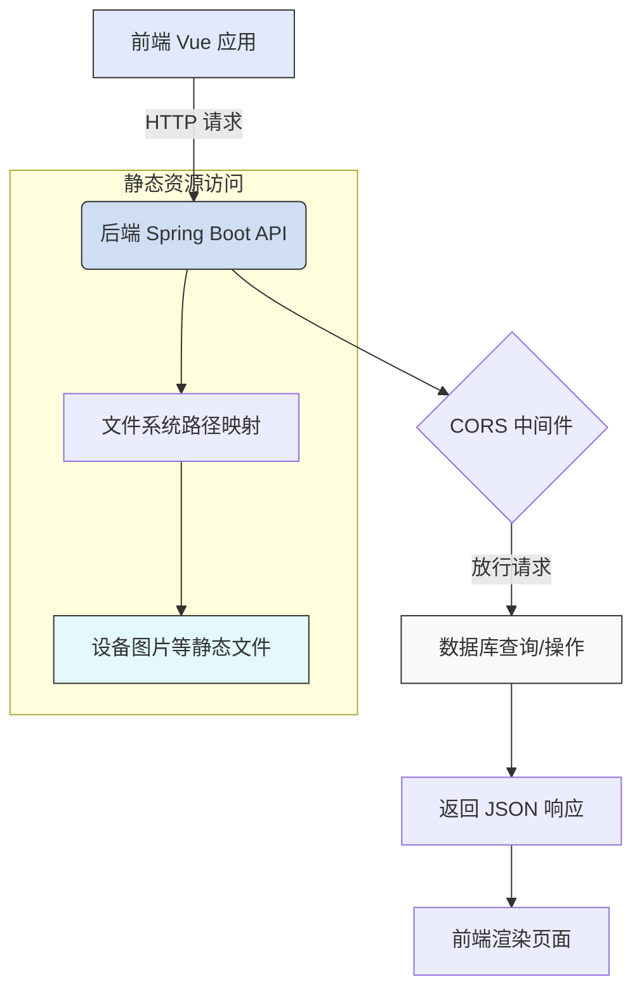

该流程图展示了系统整体的数据流动：前端发起请求 → 被后端接收 → 经过 CORS 验证 → 通过数据库或文件系统处理 → 返回响应结果 → 前端渲染显示。当请求涉及设备图片等静态资源时，会经过文件路径映射机制，直接读取本地文件。

Sources: [order-web/vue.config.js:12-19](), [order-api/src/main/resources/application.yml:1-30](), [order-api/src/main/java/com/orderapi/config/UploadConfig.java:1-3](), [order-api/src/main/java/com/orderapi/common/CorsConfig.java:5-13]()

## API 请求与响应示例

| 请求方法 | 路径 | 描述 | 参数 | 响应状态码 |
|--------|------|------|------|-----------|
| GET | `/out-devices-for-sim/findByOrderId?orderId=123` | 根据订单 ID 查询设备列表 | orderId (String) | 200 |
| POST | `/out-devices-for-sim/bind` | 绑定设备与 SIM 卡号 | list (Array of {id, sim}) | 200 |

前端在 `BindSimView.vue` 中通过 `axios.get` 和 `axios.post` 发起请求，例如获取设备列表或提交绑定信息。

Sources: [order-web/src/views/BindSimView.vue:32-40]()

## 构建与部署流程说明

1. **前端开发**  
   运行 `npm install` 安装依赖，然后执行 `npm run serve` 启动开发服务器，访问 `http://localhost:8080`。

2. **前端打包**  
   执行 `npm run build` 生成 `dist` 目录下的静态文件，可部署至 Nginx 或云服务器。

3. **后端启动**  
   运行 `mvn spring-boot:run` 启动 Spring Boot 服务，服务监听于 `http://localhost:8081`。

4. **静态资源访问**  
   前端设备图片通过 `/f/xxx.jpg` 路径访问，对应后端配置的物理路径。

5. **生产环境建议**  
   - 前端部署在 CDN 或 Nginx 上，避免本地开发环境暴露。
   - 后端数据库应配置备份策略，防止数据丢失。
   - 生产环境关闭 `devServer.open` 和 `allowedHosts` 以增强安全性。

Sources: [order-web/README.md:3-7](), [order-api/src/main/resources/application.yml:1-30]()

## 总结

本项目部署与运行环境设计清晰，前后端分离明确，配置文件标准化，具备良好的可维护性。前端通过 Vue CLI 提供了灵活的开发与构建能力，后端通过 Spring Boot 提供了稳定的服务接口与文件访问能力。整个系统在开发、测试和生产环境中均可快速部署，满足日常业务需求。关键配置项如端口、数据库、文件路径、CORS 政策均已明确记录，便于团队协作和后期扩展。<details>
<summary>Relevant source files</summary>

The following files were used as context for generating this wiki page:

['order-web/src/router/index.js', 'order-web/src/store/index.js', 'order-web/src/components/Aside.vue', 'order-web/src/components/Header.vue', 'order-web/src/main.js']
</details>

# 系统可扩展性

系统可扩展性是本项目的核心设计目标之一，旨在通过模块化架构、动态路由管理和状态管理机制，实现前端功能的灵活增减与业务逻辑的平滑演进。整个系统基于 Vue.js 框架构建，结合 Vuex 进行全局状态管理，并通过 Vue Router 实现路由的动态加载与导航控制。这种设计使得新增菜单项、页面组件或业务流程时，无需修改核心代码，只需在配置层进行声明式添加即可完成集成。

系统采用“菜单驱动”的路由结构，即菜单项与页面路径一一对应，通过 `store` 中的 `menu` 数据结构动态生成路由，从而支持前端功能的按需扩展。同时，系统支持侧边栏折叠与展开功能，提升了在不同屏幕尺寸下的用户体验，进一步增强了界面的适应性与可维护性。

## 路由与菜单的动态绑定机制

系统通过 `store` 状态管理中的 `setMenu` 和 `setRouter` 方法实现菜单与路由的动态绑定，确保菜单项的变更能实时反映在页面导航中。当菜单数据从后端获取后，系统会调用 `addNewRoute` 函数，遍历菜单列表并为每个菜单项生成对应的路由规则，最终将新路由注入到 Vue Router 中。

### 动态路由生成流程

该流程在 `store/index.js` 文件中定义，其中 `addNewRoute(menuList)` 函数负责处理菜单项与路由的映射关系。它首先获取当前路由配置（`router.options.routes`），然后遍历所有路由项，查找路径为 `/Index` 的根路由，并为其子路由追加新的菜单项路由。

```javascript
function addNewRoute(menuList) {
    let routes = router.options.routes
    routes.forEach(routeItem=>{
        if(routeItem.path=="/Index"){
            menuList.forEach(menu=>{
                let childRoute = {
                    path:'/'+menu.menuClick,
                    name:menu.menuName,
                    meta:{
                        icon:menu.menuIcon,
                        title:menu.menuName,
                    },
                    component:()=>import('../components/'+menu.menuComponent)
                }
                routeItem.children.push(childRoute)
            })
        }
    })
    resetRouter()
    router.addRoutes(routes)
}
```

Sources: [order-web/src/store/index.js:12-30]()

## 前端状态管理架构

Vuex 作为系统的唯一全局状态管理工具，承担了用户信息、菜单配置、操作标记等关键数据的存储与更新职责。其核心设计遵循“单向数据流”原则，通过 `mutations` 提供同步更新接口，避免直接修改状态，保证了数据一致性与可预测性。

### 核心状态与变更逻辑

系统定义了多个状态字段，包括 `menu`（菜单列表）、`point1`（待处理订单数）和 `point2`（待核验账单数）。这些状态通过 `mutations` 进行更新，例如：

- `setMenu(state, menuList)`：设置菜单列表并触发路由重建。
- `setRouter(state, menuList)`：仅用于路由重建，不改变菜单本身。
- `setPoint1` 和 `setPoint2`：用于标记特定业务节点的状态。

```javascript
export default new Vuex.Store({
    state:{
        menu:[],
        point1:0,
        point2:0,
    },
    mutations:{
        setMenu(state,menuList) {
            state.menu = menuList
            // 添加路由
            addNewRoute(menuList)
        },
        setRouter(state,menuList) {
            // 添加路由
            addNewRoute(menuList)
        },
        setPoint1(state,point1){
            state.point1 = point1
        },
        setPoint2(state,point2){
            state.point2 = point2
        },
    },
    getters:{
        getMenu(state){
            return state.menu
        }
    },
    plugins:[createPersistedState()]
})
```

Sources: [order-web/src/store/index.js:5-45]()

## 菜单与页面组件的解耦结构

系统通过组件化设计实现了菜单项与页面视图的解耦。每个菜单项通过 `menuComponent` 字段指定其对应的 Vue 组件路径，如 `@/components/Order` 或 `@/components/Bill`，从而实现“菜单即功能”的设计理念。

### 菜单项结构定义

菜单项的数据结构在 `Aside.vue` 中被使用，其包含以下关键字段：

| 字段 | 类型 | 描述 |
|------|------|------|
| `menuClick` | String | 路由路径（如 "Order"） |
| `menuName` | String | 显示名称（如 "订单管理"） |
| `menuIcon` | String | 图标类名（如 "el-icon-s-order"） |
| `menuComponent` | String | 组件路径（如 "OrderView"） |

```javascript
<el-menu-item :index="'/'+item.menuClick" v-for="(item,i) in menu" :key="i">
  <div>
    <i :class="item.menuIcon"></i>
    <span slot="title" >{{ item.menuName }}</span>
    <el-tag v-if="item.menuClick=='Order' && $store.state.point1>0" style="margin-left: 10px" type="danger" effect="dark">待处理</el-tag>
    <el-tag v-if="item.menuClick=='Bill' && $store.state.point2>0" style="margin-left: 10px" type="danger" effect="dark">待核验</el-tag>
  </div>
</el-menu-item>
```

Sources: [order-web/src/components/Aside.vue:6-15]()

## 用户交互与状态响应

系统通过 `Header.vue` 组件实现用户身份管理，支持个人中心跳转与退出登录功能。用户信息通过 `sessionStorage.getItem('CurUser')` 获取，并在组件初始化时解析为对象，用于后续显示与权限判断。

```javascript
data(){
    return{
      user : JSON.parse(sessionStorage.getItem('CurUser'))
    }
},
methods:{
    toUser(){
      this.$router.push("/Home")
    },
    logout(){
      this.$confirm('您确定要退出登录吗？', '提示', {
        confirmButtonText: '确定',
        type: 'warning',
        center: true,
      })
          .then(() => { 
            // 退出逻辑
          })
    }
}
```

Sources: [order-web/src/components/Header.vue:10-25]()

## 系统整体架构流程图

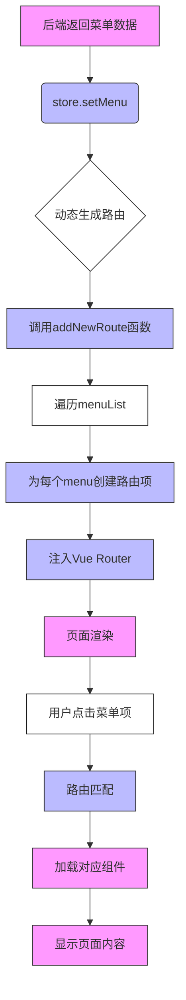

该流程图展示了系统从菜单数据获取到最终页面渲染的完整链路，体现了动态路由与状态管理的协同工作。

Sources: [order-web/src/store/index.js:12-30](), [order-web/src/components/Aside.vue:6-15](), [order-web/src/components/Header.vue:10-25]()

## 路由与状态更新流程图

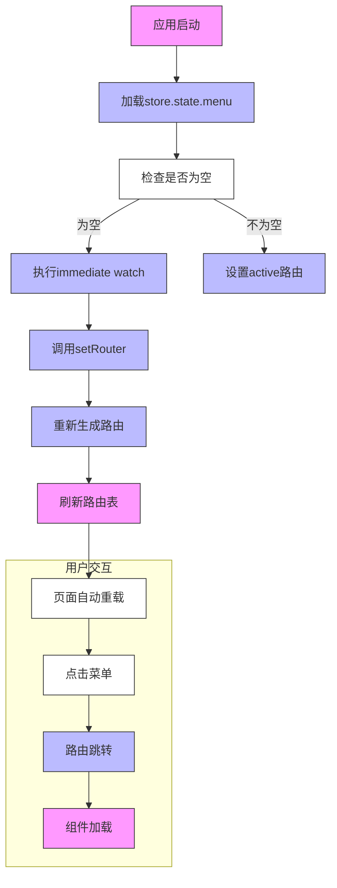

此流程图描述了系统在初始化和用户交互过程中的状态更新机制，突出其对菜单变化的响应能力。

Sources: [order-web/src/App.vue:12-18](), [order-web/src/store/index.js:12-30]()

## 配置文件与运行环境说明

系统依赖于多个配置文件来定义开发环境与编译行为。`vue.config.js` 设置了开发服务器端口为 8080，启用了 history API fallback 以支持 SPA 单页应用的路由跳转。

```javascript
module.exports = defineConfig({
    transpileDependencies: true,
    lintOnSave: false,
    devServer: {
        port: 8080,
        host: 'localhost',
        open: true,
        historyApiFallback: true,
        allowedHosts: "all",
    }
})
```

Sources: [order-web/vue.config.js:1-10]()

此外，`jsconfig.json` 定义了 TypeScript 编译选项，包括 `target: es5` 和 `module: esnext`，确保了跨平台兼容性。

```json
{
  "compilerOptions": {
    "target": "es5",
    "module": "esnext",
    "baseUrl": "./",
    "moduleResolution": "node",
    "paths": {
      "@/*": [
        "src/*"
      ]
    },
    "lib": [
      "esnext",
      "dom",
      "dom.iterable",
      "scripthost"
    ]
  }
}
```

Sources: [order-web/jsconfig.json:1-12]()

## 总结

本系统的可扩展性主要体现在三大方面：**动态路由生成机制**、**组件与菜单的解耦设计**以及**状态管理的灵活性**。通过 Vuex 管理全局状态，配合 Vue Router 的动态注册能力，系统能够轻松支持新功能的接入。同时，基于菜单的配置方式降低了前端开发的复杂度，使业务迭代更加高效。未来可通过引入更细粒度的权限控制、多级菜单支持和国际化配置，进一步提升系统的可扩展性与可维护性。